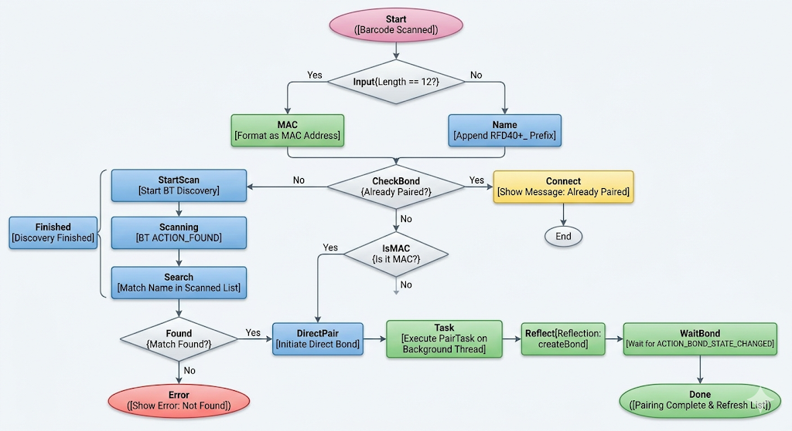
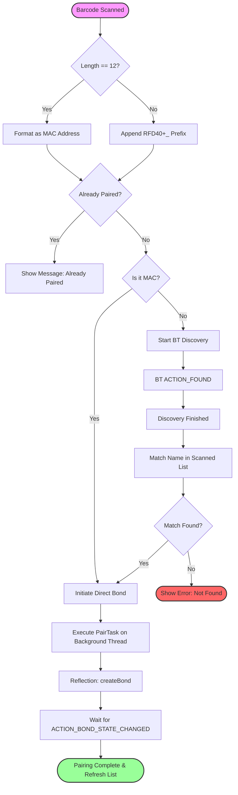

# Design Document: ScanAndPair RFD40

## Overview
The ScanAndPair application is designed to facilitate the discovery, pairing, and unpairing of Zebra RFD40 RFID readers with Android mobile computers (like the TC52). It supports pairing via scanning a barcode containing either the device's Bluetooth MAC address or its serial-number-based name.

## Architecture

The application follows a decoupled layered architecture using the **Observer Pattern**:

### 1. UI Layer (`MainActivity`)
- **Responsibilities**: 
    - Displaying the list of paired readers.
    - Capturing barcode input (MAC or Name).
    - Managing runtime permissions (Bluetooth Scan/Connect, Location).
    - Managing UI states (Loading overlay, Toasts).
    - Implementing `ScanPair.ScanPairListener` to receive updates from the logic layer.
- **Key UI Elements**: 
    - `ListView` for readers.
    - `EditText` for barcode input.
    - Custom **Loading Overlay** (non-blocking `ProgressBar`) replacing deprecated `ProgressDialog`.

### 2. Logic Layer (`ScanPair`)
- **Responsibilities**: 
    - Orchestrating the pairing workflow using `ExecutorService` for background tasks.
    - Converting raw barcode data into actionable Bluetooth identifiers.
    - Notifying the UI layer via the `ScanPairListener` interface.
- **Background Processing**: Replaced deprecated `AsyncTask` with `java.util.concurrent.Executors`.

### 3. Hardware Abstraction Layer (`Bt`)
- **Responsibilities**: 
    - Direct interaction with the `BluetoothAdapter`.
    - Handling `BroadcastReceiver` events for discovery and bonding state changes.
    - Executing low-level pairing/unpairing via reflection (`createBond`/`removeBond`).
    - Discovery timeout management using `ScheduledExecutorService`.

## Pairing Logic Flowchart





## Key Workflows

### Build, Deploy, and Run Automation
The project includes a root-level helper script, [build_deploy_run.sh](build_deploy_run.sh), to automate the common developer workflow:

1. Build the Android app with Gradle.
2. Install the selected build variant onto a connected device or emulator.
3. Launch `MainActivity`.
4. Prefill the app input field with a serial number or Bluetooth MAC string.

#### Default Input Behavior
- If no input is provided, the script injects the default value `24236525100948` into the app UI.
- The value is passed as an Android intent extra and is displayed in the `EditText` field on launch.

#### Supported Options
- `--build-type <debug|release>`: choose the variant to build and install.
- `--serial <device-serial>`: target a specific adb-connected device.
- `--input <sn-or-bt-mac>`: override the default input string.
- `--skip-build`: skip the Gradle assemble step.
- `--skip-install`: skip APK installation.
- `--skip-run`: skip app launch.

#### Example Commands
```bash
./build_deploy_run.sh
./build_deploy_run.sh --input 24236525100948
./build_deploy_run.sh --serial emulator-5554 --input ABC123456
./build_deploy_run.sh --skip-run
```

### Pairing Process
1. User scans/enters a barcode.
2. `ScanPair` parses input and notifies UI to show the loading overlay.
3. If not already paired:
    - For MAC: `Bt` initiates a bond request directly.
    - For Name: `Bt` starts discovery, searches for match, then initiates bond.
4. UI updates via `ScanPairListener.onListUpdated()` and `onOperationEnded()` when `ACTION_BOND_STATE_CHANGED` is received.

### Unpairing Process
1. User clicks a paired device in the list.
2. `ScanPair` calls `Bt.unpairReader()` in a background thread.
3. `Bt` uses reflection to trigger `removeBond`.
4. UI updates when the bond is removed.

## Best Practices Implemented
- **Localization**: All user-facing strings are moved to `res/values/strings.xml` with support for formatted arguments.
- **Thread Safety**: UI updates are ensured to run on the Main Thread via `runOnUiThread` in `MainActivity`.
- **Decoupling**: The business logic (`ScanPair`) no longer holds a direct reference to `MainActivity`, using an interface instead to prevent memory leaks.
- **Modern API Usage**: Correct handling of Android 12+ Bluetooth permissions.
- **Diagrams as Code**: Integrated Mermaid.js flowcharts for maintainable documentation.

## Future Considerations
- **ViewModel & LiveData**: Implement `ViewModel` to persist state across configuration changes (e.g., screen rotation).
- **Zebra SDK Integration**: Consider the official Zebra RFID SDK for advanced features like battery status or trigger configuration.
